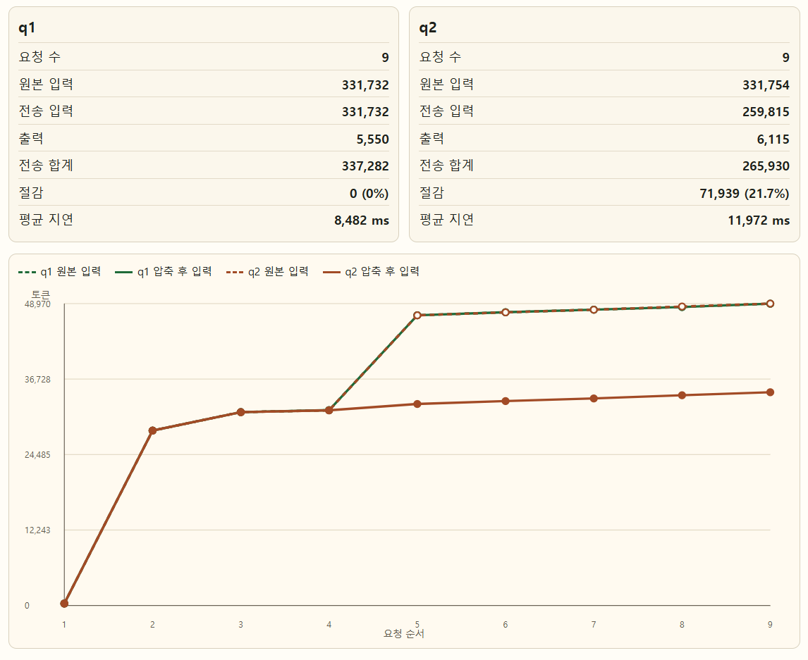

# CCIM (Coding-agent Context & Integrity Middleware)

CCIM는 코딩 에이전트와 LLM API 사이에 들어가는 로컬 게이트웨이입니다.

긴 코딩 세션에서는 대형 파일 `Read` 결과, 테스트 로그, 도구 출력이 매 요청마다 반복 전송됩니다.  
CCIM은 이런 반복 컨텍스트를 압축하고, 원본은 Redis에 보관하며, 필요할 때 다시 복구할 수 있게 합니다.  
동시에 요청별 토큰, 지연, 압축 여부, 실패 사유, 안전 장치 동작을 기록해 실제 효과를 확인할 수 있게 합니다.

**CCIM는 코딩 에이전트의 긴 작업에서 반복 컨텍스트 비용을 줄이면서 의미 손실과 write 리스크를 관측 가능한 방식으로 관리하는 미들웨어**입니다.

## 지원 범위

CCIM는 LLM API gateway로 개발합니다. Anthropic Messages 호환 요청을 받아 압축, 복원, write guard, telemetry를 적용한 뒤 upstream LLM으로 전달하는 구조입니다.

지원하는 범위:

- Anthropic Messages 호환 `/v1/messages`, `/v1/models`
- Anthropic, OpenAI, OpenAI-compatible upstream
- Redis 기반 원문 저장과 `retrieve_original` 복원
- PostgreSQL과 Admin UI 기반 요청별 telemetry
- 현재 턴 `Read` 결과 압축과 write guard

지원하지 않는 범위:

- Codex/Claude 구독제용 MCP 도구
- MCP tool/resource/prompt 기반 압축 workflow
- host가 파일을 읽은 뒤 사후 압축하는 방식

이 방향의 결정 이유와 개발 계획은 [개발 문서](docs/README.md)에 정리되어 있습니다.

## 확정된 운영 방향

아래 delivery 자동화는 repository에 구현되어 있으며, 실제 운영에는 선택한 cloud VM과 production runner의 1회 설정이 필요합니다.

- 개발과 검증은 로컬 작업 트리에서 수행합니다.
- pull request와 일반 branch push는 자동 CI만 수행합니다.
- `master` 반영 후 CI를 통과한 commit만 container image로 만들고 GHCR에 commit SHA와 immutable digest로 게시합니다.
- AWS, GCP, Oracle Cloud 등 어느 Linux VM에서도 같은 production self-hosted runner와 Docker Compose 배포 절차를 사용합니다.
- 배포 후 migration과 readiness smoke가 실패하면 직전 image digest로 되돌립니다.
- Redis, PostgreSQL과 evidence volume은 같은 VM의 private network에 두고 공용 포트로 노출하지 않습니다.
- PostgreSQL·Redis·evidence backup은 `age`로 암호화하고 외부 보관 위치는 선택한 cloud에 맞게 정합니다.

운영 배포 결정은 [ADR-0003](docs/decisions/ADR-0003-cloud-neutral-single-vm-delivery.md), 실제 VM 준비 절차는 [클라우드 중립 단일 VM delivery](docs/development/single-vm-delivery.md), GPT-5 mini 일일 검증 작업과 하루 250만 무료 공유 token 한도는 [일일 운영 검증 계획](docs/evaluation/daily-gpt5-mini-canary.md)에 기록합니다.

## 왜 필요한가

코딩 에이전트는 작업 중 다음 흐름을 자주 반복합니다.

1. 큰 파일을 읽는다.
2. 같은 파일 내용을 바탕으로 분석, 설계, 수정, 검증을 여러 턴에 걸쳐 수행한다.
3. 각 턴마다 이전 `Read` 결과가 다시 LLM 입력에 포함된다.

이 과정에서 문제가 생깁니다.

| 상황 | 문제 | 결과 |
|---|---|---|
| CCIM 미사용 | 큰 `Read` 결과가 후속 요청마다 그대로 반복 전송됨 | 입력 토큰, 비용, 지연 증가 |
| CCIM 미사용 | 테스트 로그나 도구 출력도 계속 누적됨 | 모델 입력이 커지고 중요한 정보가 묻힘 |
| 단순 압축만 하는 경우 | 코드 본문을 줄이면서 함수 호출, 필드 값, 예외 조건 같은 사실이 사라짐 | 모델이 없는 관계를 만들어내거나 잘못된 분석을 함 |
| 단순 압축만 하는 경우 | 압축된 파일을 원문 확인 없이 바로 수정함 | 라인 기준 수정과 write 안전성 리스크 발생 |
| 압축을 관리하지 않음 | 어떤 요청에서 왜 압축됐는지, 왜 스킵됐는지 보이지 않음 | 성능 개선 여부와 품질 저하 원인을 판단하기 어려움 |

CCIM는 단순 요약기가 아니라, 압축, 원본 복구, 안전 차단, telemetry, 비교 UI를 함께 제공하는 게이트웨이로 이 문제를 다룹니다.

## 컨텍스트 캐싱과 다른 점

컨텍스트 캐싱은 같은 입력을 다시 사용할 때 비용과 지연을 줄이는 기능입니다.  
하지만 코딩 에이전트 작업에서는 매 턴마다 도구 결과가 새로 붙고, 큰 파일 `Read` 결과가 대화 중간에 계속 재사용됩니다.  
이때는 provider의 cache hit만으로는 어떤 도구 출력이 비용을 만들고 있는지, 어떤 내용을 줄여도 되는지, 줄인 뒤 원본을 어떻게 확인할지 제어하기 어렵습니다.

CCIM은 이 부분을 로컬에서 다룹니다. 반복되는 도구 결과와 큰 코드 본문을 압축하고, 원본을 Redis에 저장하며, 필요할 때 다시 복구합니다.  
또한 압축 후 결과가 원본 코드의 의미를 유지했는지 확인하고, 압축된 파일을 원문 확인 없이 바로 수정하려는 경우 안전 장치로 막습니다.

| 관점 | 컨텍스트 캐싱 | CCIM |
|---|---|---|
| 주요 목적 | 같은 입력을 다시 쓸 때 비용을 줄임 | 반복되는 코드와 도구 결과를 줄이고 관리함 |
| 동작 위치 | LLM provider 쪽 기능 | 코딩 에이전트와 LLM API 사이의 로컬 게이트웨이 |
| 제어 방식 | provider의 cache hit 조건에 의존 | 어떤 내용을 압축하고 복구할지 로컬에서 제어 |
| 주 대상 | 동일하거나 거의 동일한 prompt prefix | 큰 `Read` 결과, ToolResult, 코드 본문, 반복 함수군 |
| 원본 확인 | 캐시 재사용 중심 | Redis에 원본 저장 후 `retrieve_original`로 복구 |
| 품질 확인 | cache hit 여부가 중심 | 압축 후 품질 테스트와 telemetry로 확인 |
| 수정 안전성 | 별도 write 안전 장치 없음 | 압축된 파일을 바로 수정하려 할 때 guard 가능 |

즉, CCIM은 컨텍스트 캐싱의 대체재라기보다 코딩 에이전트 작업에 맞춘 압축, 복구, 관측 계층입니다.  
캐싱이 "같은 입력을 다시 쓰는 비용 최적화"라면, CCIM은 "반복되는 작업 컨텍스트를 줄이고, 필요하면 원본을 되찾고, 그 과정의 품질과 안전성을 확인하는 계층"에 가깝습니다.

## 핵심 기능

### AST 기반 코드 압축

`src/ccim/compress/ast_compressor.py`

Python, Java, C# 코드의 함수와 메서드 본문을 AST로 찾아 `<<CTX_...>>` 마커로 치환합니다. 함수 시그니처, import, 타입 힌트, 클래스 구조처럼 모델이 코드를 이해하는 데 필요한 외곽 정보는 남기고, 긴 구현 본문은 Redis에 저장합니다.

Python 압축은 최근 다음 보강이 추가되었습니다.

- 함수 시그니처, 호출, dict write, 주요 read 접근을 `# CCIM fact:`로 남김
- 반복 함수군의 첫 함수와 마지막 함수 fact를 보존
- 직접 연결되지 않은 함수 관계도 명시함. 예를 들어 40개의 비슷한 처리 함수가 있고 실제 실행 함수는 1번만 호출하는 경우, "1번만 호출하고 40번은 호출하지 않는다"는 사실을 따로 남김

예:

```text
# CCIM fact: transform_batch_001: writes=payload['batch']=1, ...
# CCIM fact: transform_batch_040: writes=payload['batch']=40, ...
# CCIM fact: run_all: relationship=calls transform_batch_001 from transform_batch_001..transform_batch_040
# CCIM fact: run_all: does_not_call=transform_batch_040
```

이 보강은 압축 후 모델이 서로 직접 관계가 없는 식별자를 잘못 연결하는 문제를 줄이기 위해 추가되었습니다.

비유하면, 책의 긴 본문을 덮어두고 목차와 색인만 남길 때 "A 장은 B 장을 참고하지 않는다" 같은 주의 표지를 함께 붙이는 방식입니다.  
이름이 비슷하거나 같은 목록에 있다는 이유만으로 모델이 둘 사이의 관계를 상상하지 않도록 하기 위한 장치입니다.

### 현재 턴 Read 압축

일반 history 압축뿐 아니라, 현재 요청 턴에서 코딩 에이전트가 `Read`로 가져온 큰 파일 결과도 압축할 수 있습니다. 대형 파일을 읽은 직후 이어지는 분석 작업에서 효과가 큽니다.

### retrieve_original 복구

압축 원본은 Redis에 저장됩니다. `CCIM_COMPRESSION_ENABLE_RETRIEVE=true`이면 CCIM은 LLM 요청에 `retrieve_original` 도구를 주입합니다. 모델이 원본을 요구하면 CCIM이 Redis에서 원문을 찾아 다시 전달합니다.

### current-turn write guard

현재 턴에서 읽은 파일이 압축된 상태에서 모델이 바로 `Edit`, `MultiEdit`, `Write`를 호출하면 위험할 수 있습니다.  
CCIM은 이런 write tool use를 검사하고, 필요한 원본 복구가 부족하면 write를 차단한 뒤 모델에게 원본 확인 후 재시도하도록 안내합니다.  
읽은 파일과 무관한 write는 허용합니다.

### 구조화 출력 축약과 중복 제거

반복되는 ToolResult는 해시 기반 참조로 줄이고, 테스트 성공 로그, traceback, PowerShell 오류처럼 구조가 있는 긴 출력은 핵심 정보만 남깁니다. 원문은 복구 가능하도록 저장합니다.

### Admin UI와 telemetry

`tools/admin_server.py`, `tools/admin_ui/`

브라우저에서 `.env` 설정을 수정하고, CCIM 프로세스를 시작, 정지, 재시작할 수 있습니다. Redis, PostgreSQL, CCIM 상태도 확인합니다. Redis context 화면에서는 session별 context index, TTL, memory estimate, source path, symbol 정보를 확인할 수 있습니다.

Measure 화면은 요청별 원본 입력, 전송 입력, 출력, 절감량, 지연, guard, retrieve, metadata, compression detail을 보여줍니다. 기본 표시는 핵심 지표 위주로 두고, 요청 상세는 compression/retrieve/guard/stream 조건으로 필터링할 수 있습니다. 비교 결과는 Admin UI에서 markdown report로 내보낼 수 있습니다.

## 구조

```text
Coding Agent
    |
    | LLM API request
    v
CCIM Gateway
    |
    +-- PCFI Middleware
    +-- Compress Middleware
    +-- Forward + retrieve_original Interceptor
    +-- Current-Turn Write Guard
    +-- Orphan Marker Scan
    +-- Write Remap
    +-- Telemetry
    |
    v
Upstream LLM

Redis       : 압축 원본, ToolResult 원문, line mapping, session context index 저장
PostgreSQL  : 요청별 토큰, 지연, retrieve 횟수, compression detail과 operational metrics view 저장
Admin UI    : 설정, 프로세스 제어, 측정 결과, Redis context 상태 확인
```

## 최근 측정 결과

최근 2시간 기준으로 같은 task2 시나리오를 비압축 `q1`과 current-turn 압축 `q2`로 비교했습니다.

`q2`는 압축 후 품질 테스트를 통과했습니다.  
품질 테스트는 생성된 산출물이 원본 코드의 핵심 사실을 틀리게 쓰지 않았는지 확인합니다.



| 항목 | q1 비압축 | q2 current-turn 압축 |
|---|---:|---:|
| 요청 수 | 9 | 9 |
| 원본 입력 | 331,732 | 331,754 |
| 전송 입력 | 331,732 | 259,815 |
| 출력 | 5,550 | 6,115 |
| 전송 합계 | 337,282 | 265,930 |
| 절감 | 0 (0%) | 71,939 (21.7%) |
| 평균 지연 | 8,482 ms | 11,972 ms |

해석:

- 두 실행의 원본 입력 규모가 거의 같아서 A/B 비교로 볼 수 있습니다.
- q2는 9개 요청에서 전송 입력을 71,939 토큰 줄였고, 절감률은 21.7%입니다.
- 이전 압축 실행에서는 서로 직접 연결되지 않은 두 함수가 연결된 것처럼 쓰이는 오류가 있었습니다. 최근 fact manifest 보강 후 q2는 같은 품질 테스트를 통과했습니다.
- 평균 지연은 증가했습니다. 현재 구현에서는 토큰 절감과 의미 보존 보강의 비용으로 봐야 합니다.

---
단일 파일을 AST 압축기에 직접 넣었을 때는 더 큰 압축률이 나옵니다. 이는 전체 LLM 요청이 아니라 `tests/compare/large_reference.py` 파일 하나만 압축한 값이므로, 위의 전체 절감률과 구분해서 봐야 합니다.

| 항목 | 압축 전 | 압축 후 | 절감 |
|---|---:|---:|---:|
| 추정 토큰 | 12,708 | 702 | 12,006 (94.5%) |
| 바이트 | 54,107 | 2,727 | 51,380 (95.0%) |
| AST context 수 | - | 3 | - |

이 값은 CCIM의 압축기가 큰 반복 코드 파일을 얼마나 작게 만들 수 있는지 보여주는 상한에 가까운 예시입니다.  
실제 요청 전체에서는 시스템 메시지, 사용자 지시, 도구 호출, 출력 토큰, 품질 보존용 fact가 함께 들어가기 때문에  
q2 테스트의 결과처럼 낮은 절감률로 측정됩니다.

## 실행

인프라 실행:

```powershell
cd CCIM
docker compose up -d redis postgres
```

전체 gateway stack 실행:

```powershell
docker compose up -d --build --wait
curl.exe --fail http://127.0.0.1:8080/live
curl.exe --fail http://127.0.0.1:8080/ready
```

Compose는 gateway만 `127.0.0.1:8080`에 공개하고 Redis와 PostgreSQL은 내부 network에만 둡니다. PostgreSQL migration이 완료되지 않으면 gateway가 시작되지 않으며, `/ready`도 dependency 상태를 구조화해 `503`을 반환합니다.

migration 상태 확인과 적용:

```powershell
uv run python -m ccim.migrations check
uv run python -m ccim.migrations apply
```

Admin UI 실행:

```powershell
uv run python tools/admin_server.py
```

또는:

```powershell
.\run_admin.bat
```

Admin UI:

```text
http://127.0.0.1:8090
```

Admin UI에서 `CCIM 시작`을 누르면 `uv run ccim` 하위 프로세스가 실행됩니다. 설정을 저장하면 실행 중인 CCIM은 자동 재시작을 시도합니다.

## 핵심 설정

| 키 | 설명 |
|---|---|
| `CCIM_HOST` | CCIM bind host |
| `CCIM_PORT` | CCIM API 포트 |
| `CCIM_SESSION_PREFIX` | telemetry와 Measure 비교용 session prefix |
| `CCIM_LLM_PROVIDER` | upstream provider |
| `CCIM_LLM_MODEL` | upstream에 전달할 실제 모델명 |
| `CCIM_LLM_TIMEOUT_S` | upstream 응답 대기 시간 |
| `CCIM_REDIS_URL` | 압축 원본 저장 Redis |
| `CCIM_EVIDENCE_STORE_PATH` | Redis 재시작/TTL 만료 후 evidence span을 재적재할 SQLite persistent store 경로. 비우면 비활성화 |
| `CCIM_DATABASE_URL` | telemetry 저장 PostgreSQL |
| `CCIM_COMPRESSION_ENABLED` | 전체 압축 스위치 |
| `CCIM_COMPRESSION_TRIGGER_TOKENS` | history 압축 시작 입력 토큰 |
| `CCIM_COMPRESSION_TARGET_TOKENS` | 압축 후 목표 입력 토큰 |
| `CCIM_COMPRESSION_ENABLE_RETRIEVE` | `retrieve_original` 도구 주입 여부 |
| `CCIM_CURRENT_TURN_COMPRESSION_ENABLED` | 현재 턴 ToolResult 압축 여부 |
| `CCIM_CURRENT_TURN_COMPRESSION_TRIGGER_TOKENS` | 현재 턴 압축 시작 입력 토큰 |
| `CCIM_CURRENT_TURN_COMPRESSION_READ_TOOLS` | 현재 턴 압축 대상 read 도구 |
| `CCIM_COMPRESSION_CLUSTER_SUMMARY_ENABLED` | 반복 함수군 cluster 압축 여부 |
| `CCIM_COMPRESSION_WRITE_GUARD_ENABLED` | current-turn write guard 활성화 |
| `CCIM_COMPRESSION_WRITE_GUARD_TOOLS` | guard 대상 write 도구 |

대형 컨텍스트 테스트에 자주 쓰는 조합:

```env
CCIM_SESSION_PREFIX=p-test
CCIM_COMPRESSION_ENABLED=true
CCIM_COMPRESSION_TRIGGER_TOKENS=3000
CCIM_COMPRESSION_TARGET_TOKENS=2000
CCIM_COMPRESSION_ENABLE_RETRIEVE=true
CCIM_CURRENT_TURN_COMPRESSION_ENABLED=true
CCIM_CURRENT_TURN_COMPRESSION_TRIGGER_TOKENS=2000
CCIM_CURRENT_TURN_COMPRESSION_READ_TOOLS=Read
CCIM_COMPRESSION_CLUSTER_SUMMARY_ENABLED=true
CCIM_COMPRESSION_WRITE_GUARD_ENABLED=true
CCIM_COMPRESSION_WRITE_GUARD_TOOLS=Edit,MultiEdit,Write
```

압축을 완전히 끄려면 스위치를 끄면 됩니다.

```env
CCIM_COMPRESSION_ENABLED=false
```

## 측정과 검증

roadmap 01 전체 로컬 기준선:

```powershell
.\scripts\verify.ps1
```

이 명령은 lockfile, Ruff, 문서 링크, 운영 데이터 mock dry-run, unit, 외부 LLM 없는 mock integration, semantic golden fixture와 whitespace를 순서대로 확인합니다. PostgreSQL fixture와 Docker smoke는 GitHub Actions에서 별도 job으로 실행합니다.

roadmap 02 운영 데이터 축적 준비 dry-run:

```powershell
uv run python -m ccim.operations dry-run --json
uv run python -m ccim.operations report --window-days 30 --json
```

이 명령은 외부 LLM이나 실제 개인 데이터를 사용하지 않습니다. run category, 성공·실패·skip·retry·incomplete, telemetry completeness, gross/retrieve/net token 계산, 예산 hard stop과 비식별 artifact 형식을 mock data로 검증합니다. 실제 daily canary와 personal-production 기록은 단일 VM 배포와 호환성 검증을 마친 뒤 마지막 운영 단계에서 시작합니다.

Measure UI에서 prefix를 넣어 비교하고 markdown report로 export할 수 있습니다.
CLI로는 다음처럼 확인합니다.

```powershell
uv run python tests/compare/measure.py --compare q1 q2 --since 120 --verbose
```

task2 산출물 semantic checker:

```powershell
uv run python tests/compare/check_task2_semantics.py tests/compare/workspace/task2
```

직접 압축 경로 확인:

```powershell
uv run python tests/compare/direct_test.py --session direct-check
```

`direct_test.py`는 추정 토큰과 별도로 실제 upstream HTTP body bytes 및 provider가 반환한 input/output usage 합계를 표시합니다.

## 주요 파일

| 파일 | 역할 |
|---|---|
| `src/ccim/main.py` | FastAPI 앱, lifespan 초기화, middleware 체인 조립 |
| `src/ccim/api/routes.py` | `/v1/messages`, `/v1/models`, session id 처리 |
| `src/ccim/middleware/chain.py` | PCFI, 압축, retrieve, write guard, telemetry 체인 |
| `src/ccim/compress/ast_compressor.py` | tree-sitter 기반 AST 코드 압축, fact manifest 생성 |
| `src/ccim/compress/trigger.py` | 압축 후보 선택과 skip reason 진단 |
| `src/ccim/compress/structured_outputs.py` | ToolResult dedupe와 구조화 출력 축약 |
| `src/ccim/reversibility/store.py` | Redis context, ToolResult, session context index 저장소 |
| `src/ccim/reversibility/interceptor.py` | `retrieve_original` 처리 |
| `src/ccim/telemetry/logger.py` | PostgreSQL 요청 telemetry 기록 |
| `migrations/002_request_operational_metrics.sql` | feature_flags 기반 운영 지표 view |
| `migrations/003_operational_data_readiness.sql` | run·request observation·UTC token ledger와 운영 집계 view |
| `src/ccim/operations/` | 운영 run 계약, budget preflight, mock dry-run, 비식별 report와 저장소 |
| `.github/workflows/delivery.yml` | 성공한 `master` CI SHA의 GHCR 게시와 production VM 배포 |
| `deploy/single-vm/` | digest 배포·rollback, VM mock canary, 암호화 backup/restore |
| `tools/admin_server.py` | Admin UI 서버 진입점 |
| `tools/admin_ui/` | Admin UI 정적 파일과 측정 UI |
| `tests/compare/` | benchmark, measure, task fixture, semantic checker |
| `img/compare.png` | q1/q2 비교 이미지 |
| `docs/` | 목표·아키텍처·근거 정책·검증·로드맵 등 개발 기준 문서 |

## 트레이드오프

CCIM에는 다음과 같은 트레이드 오프가 있습니다.

| 선택 | 얻는 것 | 비용 |
|---|---|---|
| 입력 토큰 압축 | LLM에 보내는 토큰과 비용 감소 | 압축, 저장, 진단 과정 때문에 응답 시간이 늘어날 수 있음 |
| 원본을 Redis에 저장 | 필요할 때 원문을 빠르게 다시 가져올 수 있음 | Redis 메모리 비용이 들고, TTL이 지나면 원문을 복구할 수 없음 |
| 코드 본문을 강하게 줄이기 | 큰 파일 하나는 매우 작게 만들 수 있음 | 함수 관계나 필드 값 같은 의미가 빠지면 모델이 잘못 추측할 수 있음 |
| 구조적 사실을 압축에 함께 남기기 | 모델이 압축된 코드를 덜 오해함 | 압축본에 남기는 정보가 늘어 압축률이 조금 낮아짐 |
| 현재 읽은 파일도 바로 압축 | 큰 파일을 읽은 직후부터 토큰을 줄일 수 있음 | 그 파일을 바로 수정할 때는 원문 확인과 write guard가 필요 |
| 반복 함수군을 하나로 묶기 | 비슷한 코드가 많은 파일에서 절감 효과가 큼 | 원본을 다시 볼 때 더 넓은 범위를 복구해야 할 수도 있음 |

실제로 q1/q2 비교에서는 전송 입력을 21.7% 줄였지만 평균 지연은 증가.  
반대로 단일 파일 직접 압축에서는 94.5%까지 줄었지만,  
실제 요청 전체에는 사용자 지시, 도구 호출, 출력, 품질 보존용 정보가 함께 들어가므로 낮은 비율로 집계됨.

운영할 때는 다음을 함께 확인할 필요가 있습니다.

- 압축 후 결과물이 원본 코드의 의미를 유지했는지
- Redis TTL이 작업 시간보다 충분히 긴지
- Redis 메모리 사용량이 감당 가능한지
- 압축된 파일을 수정하기 전에 원문 복구가 되었는지
- 작은 입력에서 압축을 억지로 시도하지 않고 정상적으로 스킵되는지

스트리밍은 현재 upstream complete 응답을 받은 뒤 SSE 형식으로 변환해 반환합니다. `stream=true` 요청도 gateway 내부 upstream 호출은 `stream=false`로 처리하며, 클라이언트 응답에는 `X-CCIM-Stream-Mode: synthesized_complete_sse`를 붙입니다.
upstream 응답 조각을 즉시 중계하는 실시간 chunk relay는 retrieve loop intercept와 충돌하므로 아직 별도 경로로 분리하지 않았습니다.
